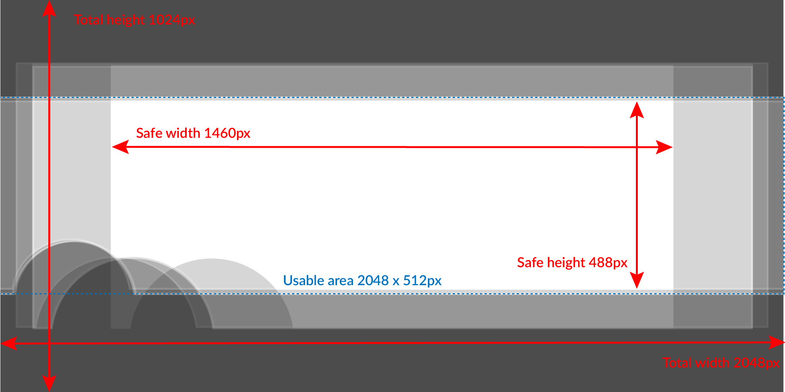

## BlueSky Banner Sizes

The internet says they should be 2048 x 2048. I have no idea where the internet gets this from
(perhaps an earlier version of BlueSky?), but a day of experimentation and screenshots suggests
that the optimal size is 2048 x 1024px:

To see how much of a banner will be visible on various devices:

* [BlueSky Banner Checker](banner.html)

Photoshop PSD template for making BlueSky banners:

* [BlueSky Banner Template (Photoshop .PSD)](bluesky-banner-photoshop.psd)

And the .AI files with the artwork from this page and the checker tool:

* [BlueSky Banner Overlays (.AI)](bluesky-banner-guide.ai)
